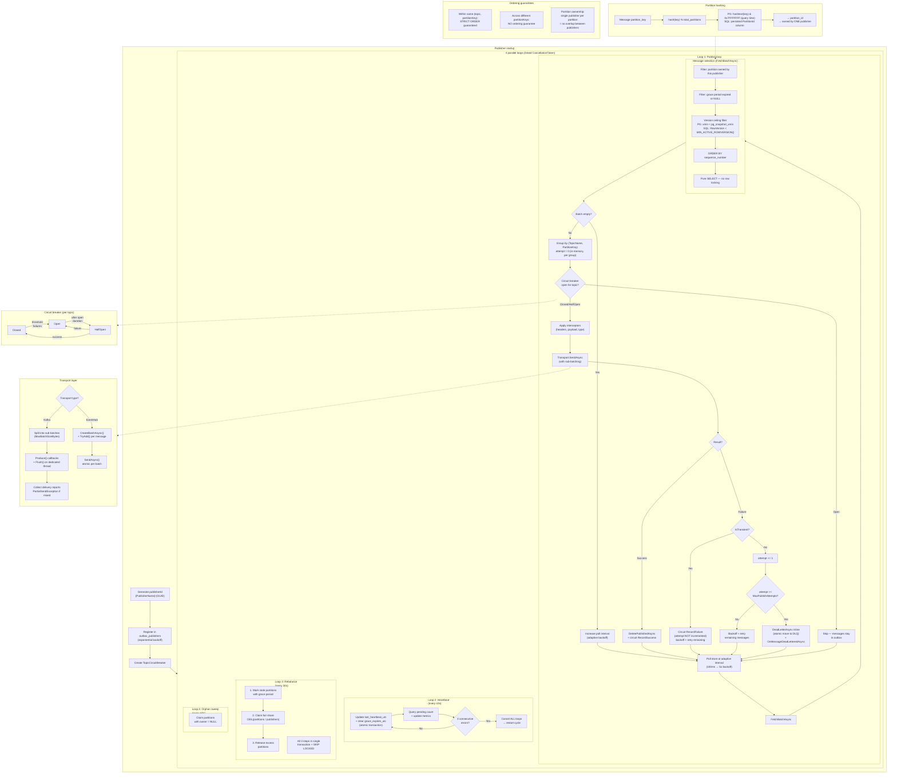
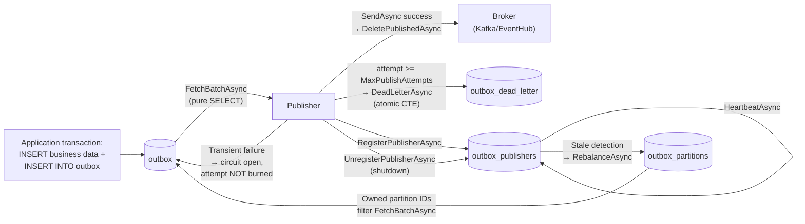

# Publisher flow

How `OutboxPublisherService` picks up messages, distributes work across instances, and delivers them to brokers.

## Diagram

## How it works

### Startup

Each publisher generates a unique publisher ID (`{PublisherName}-{GUID}`), registers itself in the `outbox_publishers` table with exponential backoff, and spins up four parallel loops tied to a shared `CancellationToken`.

### Partition hashing and ownership

Messages map to partitions via `hash(partition_key) % total_partitions`. Each partition is owned by exactly one publisher at a time—this is what enables parallel publishing without ordering conflicts.

- **PostgreSQL:** `(hashtext(key) & 0x7FFFFFFF) % total_partitions`
- **SQL Server:** `PartitionId` persisted computed column — `ABS(CAST(CHECKSUM(key) AS BIGINT)) % 64` (precomputed at INSERT time, used as index leading key)

### Publish loop

1. **Poll** the store at an adaptive interval (100ms when busy, backs off to 5s when idle)
2. **Fetch** a batch of messages—only from owned partitions, with version ceiling filter
3. **Group** messages by `(topic, partitionKey)`. Each group starts with an in-memory `attempt = 0` counter and enters a retry loop on the worker thread's stack
4. **Check circuit breaker**—if open, exit the retry loop without touching `attempt`. Messages stay in the outbox
5. **Apply interceptors** (modify headers, payload, event type)
6. **Send** via transport with sub-batching
7. **Classify failures** via `IOutboxTransport.IsTransient(Exception)`:
   - **Transient** → circuit records a failure, `attempt` is NOT incremented, loop retries after exponential backoff
   - **Non-transient** → `attempt += 1`. If `attempt >= MaxPublishAttempts`, the group is dead-lettered inline via `DeadLetterAsync` in the same iteration
8. **Finalize**—delete on full success, leave rows in the outbox on circuit open, move to dead letter on retries exhausted

### Concurrency controls

- **Partition ownership** ensures one publisher per partition—the sole isolation mechanism
- **Version ceiling filter** prevents publishing rows from in-flight write transactions
- **Grace period** on partition handover prevents overlap between old and new owners
- **Ordering** within `(topic, partitionKey)` is strict (`ORDER BY sequence_number`, which equals insert order)

### Background loops

| Loop         | Interval | Purpose                                                                                          |
| ------------ | -------- | ------------------------------------------------------------------------------------------------ |
| Heartbeat    | 10s      | Updates `last_heartbeat_utc`, clears grace periods. Cancels all loops after 3 consecutive errors |
| Rebalance    | 30s      | Marks stale partitions, claims fair share, releases excess—all in one transaction                |
| Orphan sweep | 60s      | Claims partitions with no owner (recovery after crashes)                                         |

### Circuit breaker

Each topic has its own circuit breaker: **Closed → Open → HalfOpen → Closed**. When open, messages are skipped (left in the outbox) without burning attempts—this prevents retry exhaustion during broker outages. The `IsTransient` classification is what feeds the circuit breaker; non-transient failures never trip it.

### Transport layer

- **Kafka:** splits into sub-batches by `MaxBatchSizeBytes`, uses callback-based `Produce()` + `Flush()` on a dedicated thread, reports partial failures via `PartialSendException`
- **EventHub:** uses `CreateBatchAsync()` + `TryAdd()` pattern, atomic per batch, fully async

## Database tables

### outbox

The primary event buffer. Messages are inserted here inside the same transaction as the business data change, guaranteeing atomicity.

| Column                 | Type (PG / SQL Server)             | Description                                      |
| ---------------------- | ---------------------------------- | ------------------------------------------------ |
| `sequence_number`      | `BIGINT IDENTITY`                  | PK, auto-incremented                             |
| `topic_name`           | `VARCHAR(256)` / `NVARCHAR(256)`   | Target broker topic                              |
| `partition_key`        | `VARCHAR(256)` / `NVARCHAR(256)`   | Hashed to assign partition ownership             |
| `event_type`           | `VARCHAR(256)` / `NVARCHAR(256)`   | Event type identifier                            |
| `headers`              | `VARCHAR(2000)` / `NVARCHAR(2000)` | JSON-serialized headers (nullable)               |
| `payload`              | `BYTEA` / `VARBINARY(MAX)`         | Binary event payload                             |
| `created_at_utc`       | `TIMESTAMPTZ(3)` / `DATETIME2(3)`  | Insertion timestamp (default `NOW()`)            |
| `event_datetime_utc`   | `TIMESTAMPTZ(3)` / `DATETIME2(3)`  | Business event time (debug/forensics; does not affect delivery order) |
| `payload_content_type` | `VARCHAR(100)` / `NVARCHAR(100)`   | MIME type (default `application/json`)           |
| `RowVersion`           | `ROWVERSION` (SQL Server only)     | Version ceiling for ordering safety              |

**Indexes:**

| Store      | Index               | Columns                                      | Purpose                                                         |
| ---------- | ------------------- | -------------------------------------------- | --------------------------------------------------------------- |
| SQL Server | `IX_Outbox_Pending` | `(PartitionId, SequenceNumber)` + INCLUDEs   | Per-partition Index Seek with no key lookups (fully covering)   |
| PostgreSQL | _(none beyond PK)_  | —                                            | `pk_outbox (sequence_number)` is the access path for FetchBatch |

The two stores diverge here because `partition_id` is a persisted computed column on SQL Server but a runtime expression on PostgreSQL. SQL Server can therefore seek per-partition with a covering nonclustered index (`INCLUDE` carries `Headers`, `Payload`, `PayloadContentType`, `RowVersion`, etc., eliminating clustered-PK lookups). PostgreSQL cannot index a runtime-parameterized expression without baking the modulus into the schema, so it relies on the PK-ordered sequence scan and applies the partition filter via the hash expression during the `outbox_partitions` join. At tested scale the PG plan completes in ~0.4 ms; a covering index would not help because the `xmin` visibility filter forces a heap fetch regardless.

### outbox_dead_letter

Archive for messages that exhausted `MaxPublishAttempts` non-transient attempts. Messages arrive here inline from the publish loop—there is no background sweep.

| Column                 | Type (PG / SQL Server)             | Description                                |
| ---------------------- | ---------------------------------- | ------------------------------------------ |
| `dead_letter_seq`      | `BIGINT IDENTITY`                  | PK, auto-incremented                       |
| `sequence_number`      | `BIGINT`                           | Original outbox sequence number            |
| `topic_name`           | `VARCHAR(256)` / `NVARCHAR(256)`   | Original target topic                      |
| `partition_key`        | `VARCHAR(256)` / `NVARCHAR(256)`   | Original partition key                     |
| `event_type`           | `VARCHAR(256)` / `NVARCHAR(256)`   | Original event type                        |
| `headers`              | `VARCHAR(2000)` / `NVARCHAR(2000)` | Original headers (nullable)                |
| `payload`              | `BYTEA` / `VARBINARY(MAX)`         | Original payload                           |
| `created_at_utc`       | `TIMESTAMPTZ(3)` / `DATETIME2(3)`  | Original insertion time                    |
| `attempt_count`        | `INT`                              | Final non-transient attempt count          |
| `event_datetime_utc`   | `TIMESTAMPTZ(3)` / `DATETIME2(3)`  | Original business event time (forensics)   |
| `payload_content_type` | `VARCHAR(100)` / `NVARCHAR(100)`   | Original MIME type                         |
| `dead_lettered_at_utc` | `TIMESTAMPTZ(3)` / `DATETIME2(3)`  | When the message was dead-lettered         |
| `last_error`           | `VARCHAR(2000)` / `NVARCHAR(2000)` | Final error message (nullable)             |

**Indexes:** only the PK (`dead_letter_seq` / `DeadLetterSeq`). Library replay/purge queries join against the TVP of `DeadLetterSeq` values; none of them seek by the original `sequence_number`. If operators need forensic lookups by original sequence number at scale, add an out-of-band index.

The move from `outbox` to `outbox_dead_letter` is atomic—a single CTE/OUTPUT deletes from one and inserts into the other in the same transaction. `DeadLetterAsync(sequenceNumbers, attemptCount, lastError, ct)` is called from inside the publish loop when the in-memory attempt counter hits `MaxPublishAttempts`.

### outbox_publishers

Heartbeat registry of active publisher instances. Enables failure detection and partition rebalancing.

| Column               | Type (PG / SQL Server)            | Description                          |
| -------------------- | --------------------------------- | ------------------------------------ |
| `publisher_id`       | `VARCHAR(128)` / `NVARCHAR(128)`  | PK, format: `{PublisherName}-{GUID}` |
| `registered_at_utc`  | `TIMESTAMPTZ(3)` / `DATETIME2(3)` | First registration time              |
| `last_heartbeat_utc` | `TIMESTAMPTZ(3)` / `DATETIME2(3)` | Last heartbeat (default `NOW()`)     |
| `host_name`          | `VARCHAR(256)` / `NVARCHAR(256)`  | Machine name (nullable)              |

A publisher is considered **stale** when `NOW() - last_heartbeat_utc > HeartbeatTimeoutSeconds`. Stale publishers' partitions enter a grace period before being reclaimed.

On graceful shutdown, `UnregisterPublisherAsync` releases all owned partitions and deletes the publisher row.

**Indexes:**

| Store      | Index                             | Columns                                          | Purpose                                                              |
| ---------- | --------------------------------- | ------------------------------------------------ | -------------------------------------------------------------------- |
| PostgreSQL | `ix_outbox_publishers_heartbeat`  | `(outbox_table_name, last_heartbeat_utc)`        | Active-publisher COUNTs and `NOT IN` subquery in `Rebalance`         |
| SQL Server | `IX_OutboxPublishers_Heartbeat`   | `(OutboxTableName, LastHeartbeatUtc)` + `INCLUDE (PublisherId)` | Same, fully covering the `NOT IN` subquery                           |

### outbox_partitions

Partition ownership ledger. Maps logical partitions (0–63 by default) to active publishers for work distribution.

| Column               | Type (PG / SQL Server)            | Description                            |
| -------------------- | --------------------------------- | -------------------------------------- |
| `partition_id`       | `INT`                             | PK, seeded at install (0 to N-1)       |
| `owner_publisher_id` | `VARCHAR(128)` / `NVARCHAR(128)`  | FK to `outbox_publishers` (nullable)   |
| `owned_since_utc`    | `TIMESTAMPTZ(3)` / `DATETIME2(3)` | When ownership was acquired (nullable) |
| `grace_expires_utc`  | `TIMESTAMPTZ(3)` / `DATETIME2(3)` | Grace period expiry (nullable)         |

**Partition states:**

| State    | `owner_publisher_id`   | `grace_expires_utc` | Meaning                                                        |
| -------- | ---------------------- | ------------------- | -------------------------------------------------------------- |
| Unowned  | `NULL`                 | `NULL`              | Claimable by any publisher                                     |
| Owned    | `<publisher_id>`       | `NULL`              | Only this publisher processes its messages                     |
| In grace | `<stale_publisher_id>` | Future timestamp    | Original owner may still be processing; claimable after expiry |

**Critical invariant:** The grace period gives the original owner time to finish any in-flight work before a new owner takes over. Since there are no per-message leases, partition ownership is the sole mechanism preventing two publishers from processing the same partition simultaneously.

**Indexes:**

| Store      | Index                         | Columns                                                    | Purpose                                                                                                                         |
| ---------- | ----------------------------- | ---------------------------------------------------------- | ------------------------------------------------------------------------------------------------------------------------------- |
| PostgreSQL | `ix_outbox_partitions_owner`  | `(outbox_table_name, owner_publisher_id, partition_id)`    | `GetOwnedPartitions`, `Heartbeat` partitions UPDATE, `UnregisterPublisher`, `currently_owned` COUNTs, per-owner rebalance scans |
| SQL Server | `IX_OutboxPartitions_Owner`   | Same keys + `INCLUDE (OwnedSinceUtc, GraceExpiresUtc)`     | Same roles; `INCLUDE` also makes `FetchBatch`'s partitions subquery fully covering                                              |

### Diagnostic views

Both providers include read-only views for debugging:

- **`vw_outbox`** — shows outbox messages with `payload` and `headers` decoded to text (when content type is `application/json` or `text/plain`)
- **`vw_outbox_dead_letter`** — same for dead-lettered messages, includes `dead_lettered_at_utc` and `last_error`

### SQL Server TVP

SQL Server uses a table-valued parameter type `dbo.SequenceNumberList` (`TABLE (SequenceNumber BIGINT NOT NULL PRIMARY KEY)`) to pass sequence number arrays to `DeletePublishedAsync` and `DeadLetterAsync`. PostgreSQL uses native `BIGINT[]` arrays instead.

## Data flow between tables

