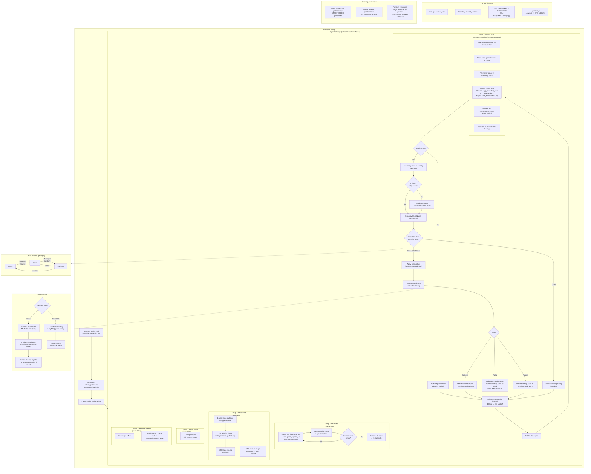
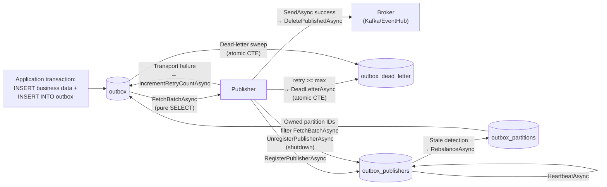

# Publisher flow

How `OutboxPublisherService` picks up messages, distributes work across instances, and delivers them to brokers.

## Diagram

## How it works

### Startup

Each publisher generates a unique publisher ID (`{PublisherName}-{GUID}`), registers itself in the `outbox_publishers` table with exponential backoff, and spins up five parallel loops tied to a shared `CancellationToken`.

### Partition hashing and ownership

Messages map to partitions via `hash(partition_key) % total_partitions`. Each partition is owned by exactly one publisher at a time—this is what enables parallel publishing without ordering conflicts.

- **PostgreSQL:** `(hashtext(key) & 0x7FFFFFFF) % total_partitions`
- **SQL Server:** `ABS(CAST(CHECKSUM(key) AS BIGINT)) % total_partitions`

### Publish loop

1. **Poll** the store at an adaptive interval (100ms when busy, backs off to 30s when idle)
2. **Fetch** a batch of messages—only from owned partitions, under max retry count, with version ceiling filter
3. **Separate** poison messages (retry >= max) and dead-letter them immediately
4. **Group** healthy messages by `(topic, partitionKey)`
5. **Check circuit breaker**—if open, skip the group (messages stay in the outbox)
6. **Apply interceptors** (modify headers, payload, event type)
7. **Send** via transport with sub-batching
8. **Finalize**—delete on success, increment retry count on failure

### Concurrency controls

- **Partition ownership** ensures one publisher per partition—the sole isolation mechanism
- **Version ceiling filter** prevents publishing rows from in-flight write transactions
- **Grace period** on partition handover prevents overlap between old and new owners
- **Ordering** within `(topic, partitionKey)` is strict (`ORDER BY event_datetime_utc, event_ordinal`)

### Background loops

| Loop              | Interval | Purpose                                                                                          |
| ----------------- | -------- | ------------------------------------------------------------------------------------------------ |
| Heartbeat         | 30s      | Updates `last_heartbeat_utc`, clears grace periods. Cancels all loops after 3 consecutive errors |
| Rebalance         | 60s      | Marks stale partitions, claims fair share, releases excess—all in one transaction                |
| Orphan sweep      | 120s     | Claims partitions with no owner (recovery after crashes)                                         |
| Dead-letter sweep | 300s     | Moves max-retry messages to the dead-letter table atomically                                     |

### Circuit breaker

Each topic has its own circuit breaker: **Closed → Open → HalfOpen → Closed**. When open, messages are skipped (left in the outbox) without burning retry counts—this prevents retry exhaustion during broker outages.

### Transport layer

- **Kafka:** splits into sub-batches by `MaxBatchSizeBytes`, uses callback-based `Produce()` + `Flush()` on a dedicated thread, reports partial failures via `PartialSendException`
- **EventHub:** uses `CreateBatchAsync()` + `TryAdd()` pattern, atomic per batch, fully async

## Database tables

### outbox

The primary event buffer. Messages are inserted here inside the same transaction as the business data change, guaranteeing atomicity.

| Column                 | Type (PG / SQL Server)             | Description                                      |
| ---------------------- | ---------------------------------- | ------------------------------------------------ |
| `sequence_number`      | `BIGINT IDENTITY`                  | PK, auto-incremented                             |
| `topic_name`           | `VARCHAR(256)` / `NVARCHAR(256)`   | Target broker topic                              |
| `partition_key`        | `VARCHAR(256)` / `NVARCHAR(256)`   | Hashed to assign partition ownership             |
| `event_type`           | `VARCHAR(256)` / `NVARCHAR(256)`   | Event type identifier                            |
| `headers`              | `VARCHAR(2000)` / `NVARCHAR(2000)` | JSON-serialized headers (nullable)               |
| `payload`              | `BYTEA` / `VARBINARY(MAX)`         | Binary event payload                             |
| `created_at_utc`       | `TIMESTAMPTZ(3)` / `DATETIME2(3)`  | Insertion timestamp (default `NOW()`)            |
| `event_datetime_utc`   | `TIMESTAMPTZ(3)` / `DATETIME2(3)`  | Business event time, primary sort key            |
| `event_ordinal`        | `INT`                              | Tiebreaker for same-timestamp events (default 0) |
| `payload_content_type` | `VARCHAR(100)` / `NVARCHAR(100)`   | MIME type (default `application/json`)           |
| `retry_count`          | `INT`                              | Delivery attempts (default 0)                    |
| `RowVersion`           | `ROWVERSION` (SQL Server only)     | Version ceiling for ordering safety              |

**Indexes:**

| Index               | Columns                                          | Purpose                                         |
| ------------------- | ------------------------------------------------ | ----------------------------------------------- |
| `ix_outbox_pending` | `(event_datetime_utc, event_ordinal)` + includes | Fast lookup of pending messages in causal order |

A single index replaces the previous lease-based partial indexes. Since there are no lease columns, all rows in the outbox are pending—the index covers the full table.

### outbox_dead_letter

Archive for messages that exceeded `MaxRetryCount`. Messages arrive here via two paths: inline dead-lettering during the publish loop, or the background dead-letter sweep.

| Column                 | Type (PG / SQL Server)             | Description                           |
| ---------------------- | ---------------------------------- | ------------------------------------- |
| `dead_letter_seq`      | `BIGINT IDENTITY`                  | PK, auto-incremented                  |
| `sequence_number`      | `BIGINT`                           | Original outbox sequence number       |
| `topic_name`           | `VARCHAR(256)` / `NVARCHAR(256)`   | Original target topic                 |
| `partition_key`        | `VARCHAR(256)` / `NVARCHAR(256)`   | Original partition key                |
| `event_type`           | `VARCHAR(256)` / `NVARCHAR(256)`   | Original event type                   |
| `headers`              | `VARCHAR(2000)` / `NVARCHAR(2000)` | Original headers (nullable)           |
| `payload`              | `BYTEA` / `VARBINARY(MAX)`         | Original payload                      |
| `created_at_utc`       | `TIMESTAMPTZ(3)` / `DATETIME2(3)`  | Original insertion time               |
| `retry_count`          | `INT`                              | Final retry count at dead-letter time |
| `event_datetime_utc`   | `TIMESTAMPTZ(3)` / `DATETIME2(3)`  | Original business event time          |
| `event_ordinal`        | `INT`                              | Original ordinal                      |
| `payload_content_type` | `VARCHAR(100)` / `NVARCHAR(100)`   | Original MIME type                    |
| `dead_lettered_at_utc` | `TIMESTAMPTZ(3)` / `DATETIME2(3)`  | When the message was dead-lettered    |
| `last_error`           | `VARCHAR(2000)` / `NVARCHAR(2000)` | Final error message (nullable)        |

**Index:** `ix_outbox_dead_letter_sequence_number` on `(sequence_number)` for lookups by original ID.

The move from `outbox` to `outbox_dead_letter` is atomic—a single CTE/OUTPUT deletes from one and inserts into the other in the same transaction.

### outbox_publishers

Heartbeat registry of active publisher instances. Enables failure detection and partition rebalancing.

| Column               | Type (PG / SQL Server)            | Description                          |
| -------------------- | --------------------------------- | ------------------------------------ |
| `publisher_id`       | `VARCHAR(128)` / `NVARCHAR(128)`  | PK, format: `{PublisherName}-{GUID}` |
| `registered_at_utc`  | `TIMESTAMPTZ(3)` / `DATETIME2(3)` | First registration time              |
| `last_heartbeat_utc` | `TIMESTAMPTZ(3)` / `DATETIME2(3)` | Last heartbeat (default `NOW()`)     |
| `host_name`          | `VARCHAR(256)` / `NVARCHAR(256)`  | Machine name (nullable)              |

A publisher is considered **stale** when `NOW() - last_heartbeat_utc > HeartbeatTimeoutSeconds`. Stale publishers' partitions enter a grace period before being reclaimed.

On graceful shutdown, `UnregisterPublisherAsync` releases all owned partitions and deletes the publisher row.

### outbox_partitions

Partition ownership ledger. Maps logical partitions (0–31 by default) to active publishers for work distribution.

| Column               | Type (PG / SQL Server)            | Description                            |
| -------------------- | --------------------------------- | -------------------------------------- |
| `partition_id`       | `INT`                             | PK, seeded at install (0 to N-1)       |
| `owner_publisher_id` | `VARCHAR(128)` / `NVARCHAR(128)`  | FK to `outbox_publishers` (nullable)   |
| `owned_since_utc`    | `TIMESTAMPTZ(3)` / `DATETIME2(3)` | When ownership was acquired (nullable) |
| `grace_expires_utc`  | `TIMESTAMPTZ(3)` / `DATETIME2(3)` | Grace period expiry (nullable)         |

**Partition states:**

| State    | `owner_publisher_id`   | `grace_expires_utc` | Meaning                                                        |
| -------- | ---------------------- | ------------------- | -------------------------------------------------------------- |
| Unowned  | `NULL`                 | `NULL`              | Claimable by any publisher                                     |
| Owned    | `<publisher_id>`       | `NULL`              | Only this publisher processes its messages                     |
| In grace | `<stale_publisher_id>` | Future timestamp    | Original owner may still be processing; claimable after expiry |

**Critical invariant:** The grace period gives the original owner time to finish any in-flight work before a new owner takes over. Since there are no per-message leases, partition ownership is the sole mechanism preventing two publishers from processing the same partition simultaneously.

### Diagnostic views

Both providers include read-only views for debugging:

- **`vw_outbox`** — shows outbox messages with `payload` and `headers` decoded to text (when content type is `application/json` or `text/plain`)
- **`vw_outbox_dead_letter`** — same for dead-lettered messages, includes `dead_lettered_at_utc` and `last_error`

### SQL Server TVP

SQL Server uses a table-valued parameter type `dbo.SequenceNumberList` (`TABLE (SequenceNumber BIGINT NOT NULL PRIMARY KEY)`) to pass sequence number arrays to `DeletePublishedAsync`, `IncrementRetryCountAsync`, and `DeadLetterAsync`. PostgreSQL uses native `BIGINT[]` arrays instead.

## Data flow between tables

